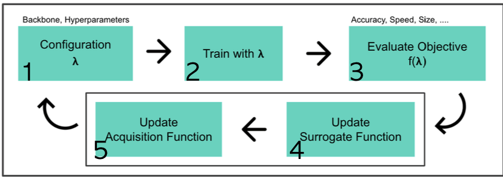
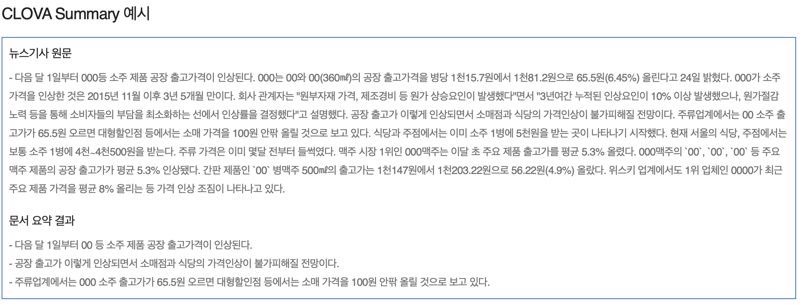

# 21.11.22

생성일: 2021년 11월 22일 오후 3:49
태그: 경량화, 시작!

## 오늘의 한 줄 평

<aside>
📌 점점 자신감이 떨어지고 번아웃 증세가 오는 것 같다.. 회고를 시작하며 이를 통해 이겨내보자 ! 👊</aside>
## 오늘의 공부/새롭게 알게된 내용

1. Bayesian Optimization with Gaussian Process Regression
   
    과정 : 
    
    
    
    1. 𝝀를 sample(observation)
    2. 해당 sample(configuration)로 DL 모델을 학습,
    3. objective를 계산(우측 point)
    4. `Surrogate model` (function)업데이트
    (ex: GP model, posterior mean, posterior variance(uncertainty))
    5. `Acquisition function` 업데이트
    (ex: Expected Improvement, Upper Confidence Bounds)
    
    **Gaussian process regression 의 *motivation* :** 
    
    > 우리가 알고자 하는 특정 위치의 $Y_*$ 값은 우리가 알고 있는 $X, Y,$ $X_*$들과(positive건, negative건) 연관이 있지 않을까?
    > 
    
    ⇒ $X, Y,$ $X_*$값으로 부터 $Y_*$를 추정, 연관에 대한 표현은 Kernel 함수 $K$로!
    
    ⇒ 📌 핵심 ! : 우리가 알고 있는 $X, f$($=Y)$ 와 알고자 하는 위치 $X_*$를 알고 있으면 이 함수에 대한 분포$f_*$를 알 수 있게 된다
    

## 오늘의 TMI

1. 최종 프젝 주제 좀 더 구체화됨 - [http://ebook.booxen.com/nia21.html](http://ebook.booxen.com/nia21.html)
    - 도서 문서 요약
    - [https://www.notion.so/0b957a421048404487b403d38e4c344a#47802ba515da41b7b0398ae84c58c744](https://www.notion.so/0b957a421048404487b403d38e4c344a)
    
    [웅진북센](http://ebook.booxen.com/nia21.html)
    
    어떤 서비스를 만들 수 있을까?
    
    요약 서비스의 경우 문서요약 → 대화 요약으로 발전이 가능 할 것이다. 
    
    요약 방식은 긴 문장형? / 핵심요소들 추출?
    
    - 네이버 클라우드의 문서요약
      
        
        
        - 네이버 뉴스의 `요약봇`에 적용
        - 마케팅, 언론, 조사기관 등 다양한 곳에 활용 가능
        
        [NAVER CLOUD PLATFORM](https://www.ncloud.com/product/aiService/clovaSummary)
        
    - 변성윤 마스터 님의 슬랙 조언
      
        https://aitech2.slack.com/archives/C02L1E93K5M/p1637050588065900
        
    
    모델 시현은 대회는 범준님 지인분께 부탁, 부캠 발표는 **`Streamlit`** 활용
    
2. **[마키나락스](https://www.makinarocks.ai/ko/vision) 검색하다 오피스 아워 자세히 못봄 ㅠㅠ**
    - 다시 되돌려 보며 앞부분 다시 정리하기 !

## 앞으로 했으면 좋을 것들 !

1. 내 노션 아카이브 정리 !
2. 깃헙 프로필 정리
3. 논문 읽은 것들 정리