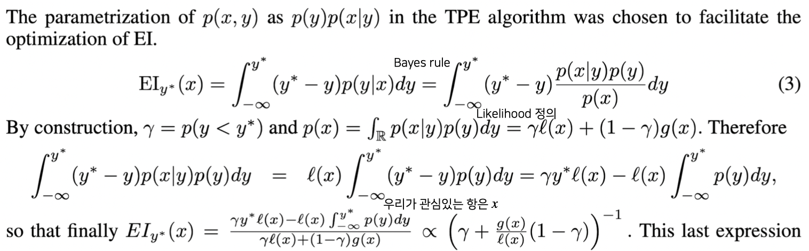

# 21.11.23

생성일: 2021년 11월 23일 오전 10:35
태그: 경량화, 알고문제풀기 !

## 오늘의 한 줄 평

<aside>
  📌 강의 하나를 듣는데 너무 오래 걸린다... 
  	  생소한 내용이 많아서 그런듯 😢</aside>

## 오늘의 공부/새롭게 알게된 내용

1. 알고 문제 풀기 성공 ! - [링크](https://github.com/CozyKim/code_practices/blob/main/BOJ/deque/15501.py)
2. 모델 최적화 강의 3,4강 수강
    1. 모델 경량화 관점에서 AutoML
       
        : 새로운 경량 모델을 찾는 관점에서 NAS(Neural Architecture Search)와, AutoML(Automated Machine Learning)이 있다.
        
    2. Gussian Process가 아직 잘 이해가 안된다.. 정리해보자 !
       
        정리는 [이쪽](https://www.notion.so/Gaussian-Process-b1b449c2397e4828a8b76755999c6695) 에서 !
        

## 오늘의 잡다한 지식

1. 최종 프로젝트 구체화 아이디어 (내가 생각했을 때 괜찮은 아이디어)
   "도서 관련 서비스를 만들어야 한다 !"
    1. 수능 문제 처럼 비문학 지문을 바탕으로 문제를 만들어 주는 Task (Q generator)
    2. 질문을 음성으로 입력 받고 QA 진행

## 앞으로 했으면 좋을 것들 !

1. 내 노션 아카이브 정리 !
2. 깃헙 프로필 정리
3. 논문 읽은 것들 정리
4. 다량 정규분포 정리해보기 !
5. 아래 사진 유도 해보기

