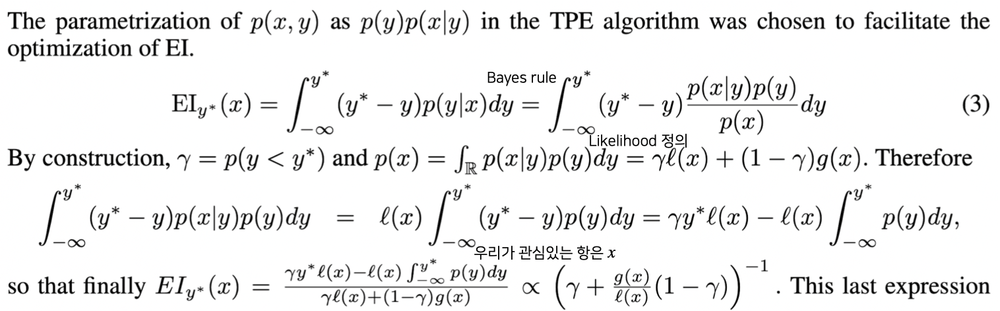

# 21.11.24

생성일: 2021년 11월 24일 오후 6:31
태그: 경량화, 알고 책보기

## 오늘의 한 줄 평

<aside>
📌 갑자기 추워져서 그런지 머리가 자주 아프군..</aside>
## 오늘의 공부/새롭게 알게된 내용

1. Gussian Process 정리 - [링크](https://www.notion.so/Gaussian-Process-Gaussian-Process-Regression-b1b449c2397e4828a8b76755999c6695)
    1. 공분산 함수에 대해서도 좀 알게 되었다
    2. 아직 여러 챕터가 있다 하나씩 클리어 하자
2. 알고리즘 책 읽기
    1. [Generator](https://www.notion.so/Generator-619ab94d9c0b4e22a5c35a0da89e12bb)
    2. [locals()](https://www.notion.so/locals-c3b191b27ada421ab4609c599b528780)
3. 최적화 강의 5강
    1. Image Augmentation 종류
    2. Augmentation을 포함한 AutoML 구성

## 오늘의 잡다한 지식

1. [DEVIEW](https://deview.kr/2021/sessions) 나중에 챙겨보기 ! - 재밌어보이는 내용이 많다 !

## 앞으로 했으면 좋을 것들 !

1. 내 노션 아카이브 정리 !
2. 깃헙 프로필 정리
3. 논문 읽은 것들 정리
4. 다량 정규분포 정리해보기 !
5. 아래 사진 유도 해보기

