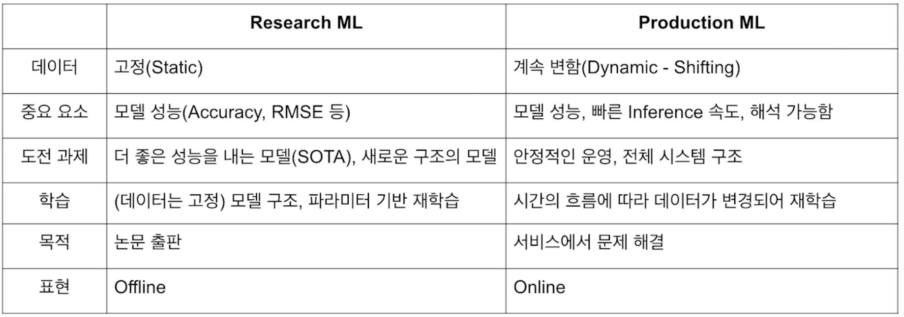

# 21.12.07

생성일: 2021년 12월 7일 오후 11:01
태그: 모델 serving

## 오늘의 한 줄 평

<aside>
📌  기대하던 serving 파트 시작 !</aside>

## 오늘의 공부/새롭게 알게된 내용

1. MLOps란?
    1. 머신 러닝 모델운영하면서 반복적으로 필요한 업무 자동화 하는 과정
    2. 머신러닝 엔지니어링 + 데이터 엔지니어링 + 클라우드 + 인프라
    
    
    
2. server 인프라 - 클라우드 서비스
   
    : AWS, GCP(구글 클라우드 플랫폼), Azure, NCP 등
    
3. MLflow
   
    : 하이퍼 파라미터, 모델 구조, 모델 Artifact, 이미지, 모델 생성일, 모델 성능, 모델 메타 정보등 모델을 학습시키면서 나오는 부산물, 정보들을 저장 관리 해준다.
    
4. Batch serving VS Online serving
    1. Batch serving : 많은 양의 데이터를 일정 주기로 한번에 예측
    2. Online serving : 실시간 예측해서 동시에 요청이 들어와도 병목이 없어야하고 확장 가능하도록 준비
5. `Voila`
    1. 주피터노트북 기반의 프로토타입 생성에 도움을 주는 라이브러리(? 주피터 확장?)

## 앞으로 했으면 좋을 것들 !

1. 내 노션 아카이브 정리 !
2. 깃헙 프로필 정리
3. 논문 읽은 것들 정리
4. 다량 정규분포 정리해보기 !
5. 아래 사진 유도 해보기

1. [DEVIEW](https://deview.kr/2021/sessions) 나중에 챙겨보기 ! - 재밌어보이는 내용이 많다 !